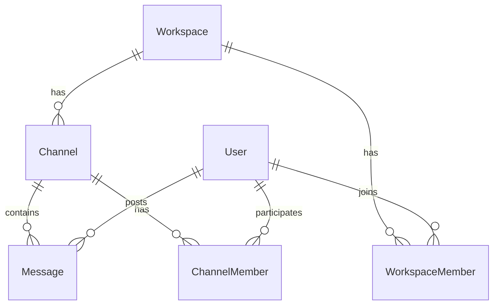
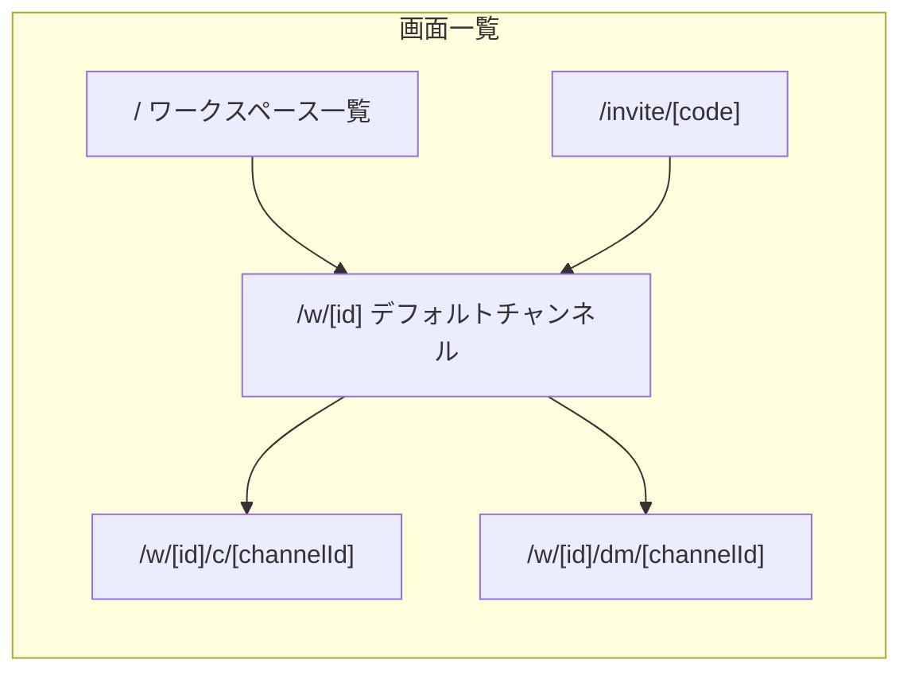
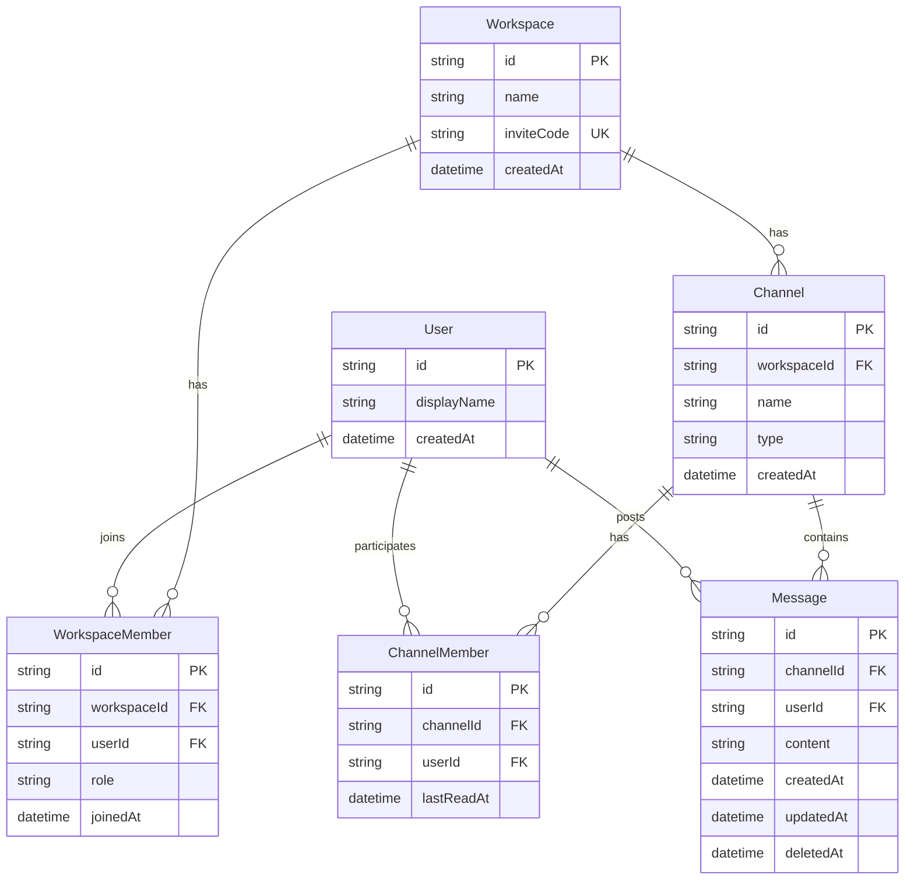

# ChatSpace — ベース要件定義書

Slack 簡易版チャットアプリの要件定義。小規模チーム向けのテキストコミュニケーション基盤として、MVP（Phase 1）の実装範囲と将来拡張の境界を定義する。

---

## 1. プロジェクト概要

| 項目 | 内容 |
|------|------|
| プロダクト名 | ChatSpace（仮） |
| 目的 | 小規模チームがチャンネルと DM でテキストコミュニケーションできる |
| 対象ユーザー | 5〜30 人規模のチーム・プロジェクトメンバー |
| 参考プロダクト | Slack（簡易版） |
| 非目標 | エンタープライズ SSO、ボット、ビデオ通話、高度な検索 |

### 1.1 背景

`chat-app` はグリーンフィールドプロジェクトとして新規開発する。兄弟プロジェクト [task-app](https://github.com/rocky-rocky14/task-app)（Trello 風タスク管理）と同じ思想を採用し、**表示名入力 + 招待リンク** によるシンプルな参加フローで、認証基盤の構築コストを抑える。

### 1.2 設計方針

- **シンプルさ優先**: フル認証なし、最小限のエンティティで Slack の核心体験を再現する
- **task-app との一貫性**: 技術スタック・招待フロー・デプロイ手順を揃え、学習コストを下げる
- **段階的拡張**: MVP で会話の基本を完成させ、スレッド・リアクション等は Phase 2 以降に回す

---

## 2. 用語定義



| 用語 | 定義 |
|------|------|
| **ユーザー** | 表示名を持つ利用者。ブラウザの localStorage で識別子を保持する |
| **ワークスペース** | チーム単位のコンテナ。task-app の「プロジェクト」に相当 |
| **チャンネル** | ワークスペース内の公開トピック別会話室（例: `#general`） |
| **DM** | 2 人限定のプライベート会話。内部的には `type = dm` のチャンネルとして表現する |
| **メッセージ** | チャンネルまたは DM に投稿されるテキスト |
| **未読** | ユーザーが最後にチャンネルを閲覧した時点以降に投稿されたメッセージ |
| **招待リンク** | ワークスペースへの参加用 URL（`/invite/[code]`） |

---

## 3. 機能要件

### 3.1 MVP（Phase 1）— 必須

#### ユーザー・ワークスペース

| ID | 要件 | 受け入れ基準 |
|----|------|-------------|
| U-01 | 初回アクセス時に表示名を入力して利用開始 | 表示名未設定時は入力画面を表示し、localStorage に保存する |
| U-02 | ワークスペースを新規作成できる | 名前入力で作成し、作成者が admin メンバーになる |
| U-03 | 招待リンクでワークスペースに参加できる | `/invite/[code]` から参加する。既存メンバーは重複参加しない |
| U-04 | 複数ワークスペースに所属できる | サイドバーまたはホーム画面でワークスペースを切り替えられる |

#### チャンネル

| ID | 要件 | 受け入れ基準 |
|----|------|-------------|
| C-01 | 公開チャンネルを作成できる | 名前は英小文字・数字・ハイフンのみ。同一ワークスペース内で重複不可 |
| C-02 | チャンネル一覧をサイドバーに表示 | 所属ワークスペースの公開チャンネルのみ表示する |
| C-03 | チャンネルを選択してメッセージ履歴を表示 | 最新メッセージが下、古いメッセージは上にスクロールして遡れる |
| C-04 | デフォルトチャンネル `#general` を自動作成 | ワークスペース作成時に生成し、全メンバーがアクセスできる |

#### メッセージ

| ID | 要件 | 受け入れ基準 |
|----|------|-------------|
| M-01 | テキストメッセージを投稿できる | Enter で送信、Shift+Enter で改行。空メッセージは送信不可 |
| M-02 | 自分のメッセージを編集できる | 編集済みラベル `(edited)` を表示する |
| M-03 | 自分のメッセージを削除できる | 論理削除し「このメッセージは削除されました」と表示する |
| M-04 | 投稿者名・タイムスタンプを表示 | 相対時刻（「3分前」）をデフォルトとし、ホバーで絶対時刻を表示する |
| M-05 | リアルタイムで新着メッセージを受信 | 他ユーザーの投稿が 3 秒以内に画面に反映される |

#### DM

| ID | 要件 | 受け入れ基準 |
|----|------|-------------|
| D-01 | ワークスペースメンバー一覧から DM を開始 | 既存 DM があれば新規作成せずそちらを開く |
| D-02 | DM 一覧をサイドバーに表示 | 相手の表示名で表示する |
| D-03 | DM は当事者 2 人のみ閲覧可能 | 他メンバーからはアクセス不可（API でも 403 を返す） |

#### 未読管理

| ID | 要件 | 受け入れ基準 |
|----|------|-------------|
| N-01 | 未読メッセージ数をチャンネル/DM 横にバッジ表示 | 自分が最後に閲覧した時点以降の件数を表示する |
| N-02 | チャンネルを開くと未読を既読にする | `lastReadAt` を更新しバッジを消す |

---

### 3.2 Phase 2 — 将来拡張（MVP 外）

以下は要件定義に記載するが、Phase 1 では実装しない。

| 優先度 | 機能 | 概要 |
|--------|------|------|
| 高 | スレッド（返信） | メッセージへの返信をスレッドとして表示 |
| 高 | リアクション（絵文字） | メッセージへの絵文字リアクション |
| 中 | ファイル・画像添付 | 画像プレビュー付きのファイル共有 |
| 中 | メッセージ検索 | ワークスペース横断のキーワード検索 |
| 中 | @メンション + 通知 | ユーザー名メンションと未読通知 |
| 低 | プライベートチャンネル | 招待制の非公開チャンネル |
| 低 | メッセージピン留め | チャンネル内の重要メッセージ固定 |

---

### 3.3 明示的にスコープ外

| カテゴリ | 項目 | 理由 |
|---------|------|------|
| 認証 | メール/パスワード認証、OAuth | task-app と同様、シンプル参加フローを優先 |
| 連携 | ボット・Webhook 連携 | MVP の範囲外 |
| 通信 | ビデオ/音声通話 | テキストチャットに集中 |
| クライアント | モバイルネイティブアプリ | Web レスポンシブのみ対応 |
| セキュリティ | E2E 暗号化 | 小規模チーム向けの簡易版として対象外 |
| 運用 | 監査ログ・コンプライアンス機能 | エンタープライズ要件として対象外 |

---

## 4. 画面構成

### 4.1 画面一覧



| パス | 画面名 | 説明 |
|------|--------|------|
| `/` | ワークスペース一覧 | 所属ワークスペースの一覧と新規作成 |
| `/w/[id]` | ワークスペースホーム | デフォルトチャンネル（`#general`）へリダイレクト |
| `/w/[id]/c/[channelId]` | チャンネル | 公開チャンネルのメッセージタイムライン |
| `/w/[id]/dm/[channelId]` | DM | 1 対 1 のダイレクトメッセージ |
| `/invite/[code]` | 招待参加 | 招待リンクからのワークスペース参加 |

### 4.2 レイアウト（Slack 風 3 カラム）

| 領域 | 内容 |
|------|------|
| **左サイドバー** | ワークスペース切替、チャンネル一覧、DM 一覧、「+ チャンネル作成」 |
| **中央メイン** | チャンネル名ヘッダー、メッセージタイムライン、メッセージ入力欄 |
| **右パネル（任意）** | メンバー一覧、DM 開始ボタン（Phase 1 は折りたたみ可能な簡易版で可） |

### 4.3 レスポンシブ方針

| 画面幅 | 挙動 |
|--------|------|
| 768px 以上 | 3 カラムレイアウト（左サイドバー常時表示） |
| 768px 未満 | 左サイドバーをハンバーガーメニューで折りたたみ。中央メインを全幅表示 |

---

## 5. データモデル

PostgreSQL + Prisma を前提としたエンティティ設計。

### 5.1 ER 図



### 5.2 エンティティ詳細

#### User

| カラム | 型 | 説明 |
|--------|-----|------|
| id | UUID | 主キー。クライアント生成または初回 API 呼び出し時に発行 |
| displayName | String | 表示名 |
| createdAt | DateTime | 作成日時 |

#### Workspace

| カラム | 型 | 説明 |
|--------|-----|------|
| id | UUID | 主キー |
| name | String | ワークスペース名 |
| inviteCode | String (unique) | 招待用コード（UUID 自動生成） |
| createdAt | DateTime | 作成日時 |

#### WorkspaceMember

| カラム | 型 | 説明 |
|--------|-----|------|
| id | UUID | 主キー |
| workspaceId | UUID | ワークスペース FK |
| userId | UUID | ユーザー FK |
| role | Enum | `admin` または `member` |
| joinedAt | DateTime | 参加日時 |

ユニーク制約: `(workspaceId, userId)`

#### Channel

| カラム | 型 | 説明 |
|--------|-----|------|
| id | UUID | 主キー |
| workspaceId | UUID | ワークスペース FK |
| name | String | チャンネル名（DM の場合は `dm-{userId1}-{userId2}` 等の内部名） |
| type | Enum | `public` または `dm` |
| createdAt | DateTime | 作成日時 |

ユニーク制約: `(workspaceId, name)` — 公開チャンネルのみ適用

#### ChannelMember

| カラム | 型 | 説明 |
|--------|-----|------|
| id | UUID | 主キー |
| channelId | UUID | チャンネル FK |
| userId | UUID | ユーザー FK |
| lastReadAt | DateTime | 最終閲覧日時（未読計算に使用） |

ユニーク制約: `(channelId, userId)`

#### Message

| カラム | 型 | 説明 |
|--------|-----|------|
| id | UUID | 主キー |
| channelId | UUID | チャンネル FK |
| userId | UUID | 投稿者 FK |
| content | String | メッセージ本文 |
| createdAt | DateTime | 投稿日時 |
| updatedAt | DateTime | 最終更新日時 |
| deletedAt | DateTime? | 削除日時（null なら有効） |

### 5.3 DM の実装方針

- `Channel.type = dm` とし、2 人の `ChannelMember` で表現する
- DM 開始 API で同一ペアの既存 DM を検索し、存在すればそれを返す（重複作成しない）
- DM チャンネルへのアクセスは `ChannelMember` に含まれるユーザーのみ許可する
- 公開チャンネルはワークスペース参加時に `ChannelMember` を自動作成する（`#general` および既存公開チャンネル）

### 5.4 Prisma スキーマ（参考）

```prisma
enum WorkspaceRole {
  admin
  member
}

enum ChannelType {
  public
  dm
}

model User {
  id          String   @id @default(uuid())
  displayName String
  createdAt   DateTime @default(now())
  memberships WorkspaceMember[]
  channelMembers ChannelMember[]
  messages    Message[]
}

model Workspace {
  id         String   @id @default(uuid())
  name       String
  inviteCode String   @unique @default(uuid())
  createdAt  DateTime @default(now())
  members    WorkspaceMember[]
  channels   Channel[]
}

model WorkspaceMember {
  id          String        @id @default(uuid())
  workspaceId String
  userId      String
  role        WorkspaceRole @default(member)
  joinedAt    DateTime      @default(now())
  workspace   Workspace     @relation(fields: [workspaceId], references: [id], onDelete: Cascade)
  user        User          @relation(fields: [userId], references: [id], onDelete: Cascade)

  @@unique([workspaceId, userId])
}

model Channel {
  id          String      @id @default(uuid())
  workspaceId String
  name        String
  type        ChannelType @default(public)
  createdAt   DateTime    @default(now())
  workspace   Workspace   @relation(fields: [workspaceId], references: [id], onDelete: Cascade)
  members     ChannelMember[]
  messages    Message[]

  @@unique([workspaceId, name])
}

model ChannelMember {
  id         String   @id @default(uuid())
  channelId  String
  userId     String
  lastReadAt DateTime @default(now())
  channel    Channel  @relation(fields: [channelId], references: [id], onDelete: Cascade)
  user       User     @relation(fields: [userId], references: [id], onDelete: Cascade)

  @@unique([channelId, userId])
}

model Message {
  id        String    @id @default(uuid())
  channelId String
  userId    String
  content   String
  createdAt DateTime  @default(now())
  updatedAt DateTime  @updatedAt
  deletedAt DateTime?
  channel   Channel   @relation(fields: [channelId], references: [id], onDelete: Cascade)
  user      User      @relation(fields: [userId], references: [id], onDelete: Cascade)
}
```

---

## 6. API 設計

Next.js API Routes を想定。全 API でリクエストヘッダー `X-User-Id` によりユーザーを識別する（task-app の表示名方式を拡張）。

### 6.1 エンドポイント一覧

| メソッド | パス | 用途 |
|---------|------|------|
| POST | `/api/users` | ユーザー作成（表示名登録） |
| GET | `/api/users/[id]` | ユーザー情報取得 |
| POST | `/api/workspaces` | ワークスペース作成 |
| GET | `/api/workspaces` | 所属ワークスペース一覧 |
| GET | `/api/workspaces/[id]` | ワークスペース詳細 |
| GET | `/api/invite/[code]` | 招待コードの検証・ワークスペース情報取得 |
| POST | `/api/invite/[code]` | 招待コードでワークスペースに参加 |
| GET | `/api/workspaces/[id]/channels` | チャンネル一覧 |
| POST | `/api/workspaces/[id]/channels` | チャンネル作成 |
| GET | `/api/workspaces/[id]/members` | メンバー一覧 |
| POST | `/api/workspaces/[id]/dm` | DM 開始（既存 DM があれば返却） |
| GET | `/api/channels/[id]/messages` | メッセージ一覧（ページネーション対応） |
| POST | `/api/channels/[id]/messages` | メッセージ投稿 |
| PATCH | `/api/messages/[id]` | メッセージ編集（投稿者のみ） |
| DELETE | `/api/messages/[id]` | メッセージ削除（投稿者のみ、論理削除） |
| POST | `/api/channels/[id]/read` | 既読マーク（`lastReadAt` 更新） |
| GET | `/api/workspaces/[id]/unread` | ワークスペース内の未読数一覧 |
| GET | `/api/workspaces/[id]/unread` | ワークスペース内の未読数一覧（チャンネル API に統合） |

### 6.2 主要 API のリクエスト/レスポンス

#### POST `/api/workspaces`

```json
// Request
{ "name": "開発チーム", "userId": "uuid" }

// Response 201
{
  "id": "uuid",
  "name": "開発チーム",
  "inviteCode": "uuid",
  "defaultChannelId": "uuid"
}
```

ワークスペース作成時に `#general` チャンネルと作成者の `WorkspaceMember`（role: admin）、`ChannelMember` を同時作成する。

#### POST `/api/channels/[id]/messages`

```json
// Request
{ "content": "おはようございます" }

// Response 201
{
  "id": "uuid",
  "channelId": "uuid",
  "userId": "uuid",
  "content": "おはようございます",
  "createdAt": "2026-06-20T10:00:00Z",
  "user": { "id": "uuid", "displayName": "太郎" }
}
```

#### GET `/api/channels/[id]/messages`

クエリパラメータ: `?cursor=<messageId>&limit=50`

```json
// Response 200
{
  "messages": [...],
  "nextCursor": "uuid-or-null"
}
```

### 6.3 リアルタイム更新方針

Vercel サーバーレス環境では WebSocket / SSE の常時接続が制限されるため、MVP では **短周期ポーリング** を採用する。

| 方式 | メリット | デメリット | 推奨 |
|------|---------|-----------|------|
| **短周期ポーリング（3 秒）** | 実装が単純。Vercel で確実に動作 | サーバー負荷・若干の遅延 | **MVP 推奨（Vercel 本番）** |
| **SSE（Server-Sent Events）** | サーバーからのプッシュが可能 | Vercel では接続タイムアウトの制約あり | セルフホスト時に検討 |
| **WebSocket（外部サービス）** | 双方向・低遅延 | Pusher/Ably 等の追加コスト | Phase 2 以降で検討 |

**MVP 推奨実装（Vercel 向け）**:

1. チャンネル表示中は 3 秒間隔で `GET /api/channels/[id]/messages?since=<timestamp>` をポーリング
2. 未読バッジ更新はワークスペース表示中に 5 秒間隔でチャンネル一覧 API をポーリング

### 6.4 認可ルール

| 操作 | 条件 |
|------|------|
| ワークスペース閲覧 | `WorkspaceMember` に含まれること |
| 公開チャンネル閲覧・投稿 | ワークスペースメンバーであること |
| DM 閲覧・投稿 | `ChannelMember` に含まれること |
| メッセージ編集・削除 | 投稿者本人であること |
| チャンネル作成 | ワークスペースメンバーであること |

---

## 7. 非機能要件

| カテゴリ | 要件 | 目標値 |
|---------|------|--------|
| パフォーマンス | メッセージ初回表示 | 2 秒以内 |
| パフォーマンス | リアルタイム遅延 | 3 秒以内 |
| 可用性 | デプロイ先 | Vercel + Neon（task-app と同構成） |
| セキュリティ | 招待コード | UUID ベースの推測困難な文字列 |
| セキュリティ | DM アクセス制御 | ChannelMember 以外は 403 |
| セキュリティ | メッセージ編集・削除 | 投稿者以外は 403 |
| ユーザビリティ | 対応ブラウザ | Chrome, Firefox, Safari, Edge（最新 2 バージョン） |
| ユーザビリティ | レイアウト | デスクトップ優先、768px 以上で 3 カラム |
| データ保持 | メッセージ削除 | 論理削除（`deletedAt` を設定） |
| データ保持 | ワークスペース削除 | カスケード削除（メンバー・チャンネル・メッセージ） |
| スケーラビリティ | 想定規模 | ワークスペース 1 あたり 30 人、チャンネル 50 個、メッセージ 10 万件 |

---

## 8. 技術スタック

task-app との一貫性を優先した推奨構成。

| レイヤー | 技術 | 備考 |
|---------|------|------|
| フロントエンド | Next.js 16, React 19, Tailwind CSS | App Router |
| バックエンド | Next.js API Routes | サーバーレス関数 |
| データベース | PostgreSQL (Neon) + Prisma | `@prisma/adapter-pg` + `pg` |
| リアルタイム | 3 秒ポーリング（Vercel 向け） | MVP |
| デプロイ | Vercel | Hobby プラン（無料） |
| 状態管理 | React Context + SWR/fetch | 外部ライブラリ最小限 |

### 8.1 プロジェクト構成（想定）

```
chat-app/
  docs/
    REQUIREMENTS.md          # 本ドキュメント
  prisma/
    schema.prisma            # データベーススキーマ
    migrations/              # マイグレーション
  src/
    app/
      page.tsx               # ワークスペース一覧
      w/[id]/page.tsx        # ワークスペースホーム
      w/[id]/c/[channelId]/page.tsx  # チャンネル
      w/[id]/dm/[channelId]/page.tsx # DM
      invite/[code]/page.tsx # 招待参加
      api/                   # API Routes
    components/              # UI コンポーネント
    lib/                     # ユーティリティ（db, user, types）
  .env.example
  README.md
```

---

## 9. ユーザーストーリー

| # | ロール | ストーリー | 受け入れ基準 |
|---|--------|-----------|-------------|
| US-01 | チームリーダー | ワークスペースを作成し、招待リンクを共有したい。メンバーを素早く集めたいから。 | 作成後に招待 URL がコピーできる |
| US-02 | 新メンバー | 招待リンクから参加し、すぐに会話を始めたい。面倒な登録を避けたいから。 | 表示名入力のみで `#general` にアクセスできる |
| US-03 | メンバー | `#general` でメッセージを投稿したい。全員に連絡したいから。 | メッセージが全メンバーの画面に表示される |
| US-04 | メンバー | トピック別のチャンネルを作成したい。会話を整理したいから。 | `#` 付きチャンネルが作成され、サイドバーに表示される |
| US-05 | メンバー | 特定の人と DM で会話したい。個別の相談があるから。 | 2 人だけが閲覧できる DM が開始できる |
| US-06 | メンバー | 投稿したメッセージを修正したい。誤字を直したいから。 | 自分のメッセージのみ編集でき `(edited)` が付く |
| US-07 | メンバー | 不要なメッセージを削除したい。誤送信を取り消したいから。 | 自分のメッセージのみ論理削除できる |
| US-08 | メンバー | 未読バッジで返信が必要な会話を把握したい。見落としを防ぎたいから。 | 未読件数がサイドバーに表示され、閲覧で消える |
| US-09 | メンバー | 他の人の新着メッセージをリアルタイムで見たい。すぐに返信したいから。 | 他者の投稿が 3 秒以内に画面に現れる |
| US-10 | メンバー | 複数のワークスペースを使い分けたい。プロジェクトごとに会話を分けたいから。 | ホーム画面でワークスペースを切り替えられる |

---

## 10. 受け入れテスト観点

### 10.1 オンボーディング・ワークスペース

- [ ] 表示名未設定時にオンボーディング画面が表示される
- [ ] 表示名入力後、localStorage に保存され次回以降スキップされる
- [ ] ワークスペース作成後 `#general` チャンネルが存在する
- [ ] ワークスペース作成者が admin メンバーになる
- [ ] 招待リンクから別ユーザーが参加できる
- [ ] 既存メンバーが招待リンクから再参加しても重複しない

### 10.2 チャンネル・メッセージ

- [ ] 公開チャンネルを作成でき、サイドバーに表示される
- [ ] チャンネル名の重複が拒否される
- [ ] テキストメッセージを投稿でき、タイムラインに表示される
- [ ] Enter で送信、Shift+Enter で改行が動作する
- [ ] 自分のメッセージのみ編集でき `(edited)` ラベルが付く
- [ ] 自分のメッセージのみ削除でき、削除済み表示になる
- [ ] 他ユーザーのメッセージは編集・削除できない（403）

### 10.3 DM

- [ ] メンバー一覧から DM を開始できる
- [ ] 同一ペアで DM を再開始すると既存 DM が開く
- [ ] DM は当事者 2 人のみ閲覧・投稿できる
- [ ] 第三者が DM にアクセスすると 403 が返る

### 10.4 リアルタイム・未読

- [ ] 2 人が同じチャンネルでリアルタイムに会話できる（3 秒以内）
- [ ] 未読バッジが正しい件数を表示する
- [ ] チャンネルを開くと未読バッジが消える
- [ ] 別チャンネルの未読数は維持される

### 10.5 非機能

- [ ] 768px 未満でサイドバーが折りたたまれる
- [ ] Chrome / Safari / Firefox で基本操作が動作する

---

## 11. 実装ガイドライン（task-app パターン準拠）

task-app で確立済みのパターンを chat-app でも踏襲する。

### 11.1 ユーザー識別（localStorage）

task-app では表示名のみを localStorage に保持している。chat-app では **ユーザー ID + 表示名** を保持するよう拡張する。

```typescript
// src/lib/user.ts（想定）
const USER_ID_KEY = "chat-app-user-id";
const USER_NAME_KEY = "chat-app-user-name";

export function getUserId(): string {
  if (typeof window === "undefined") return "";
  return localStorage.getItem(USER_ID_KEY) ?? "";
}

export function getUserName(): string {
  if (typeof window === "undefined") return "";
  return localStorage.getItem(USER_NAME_KEY) ?? "";
}

export function setUser(id: string, name: string): void {
  localStorage.setItem(USER_ID_KEY, id);
  localStorage.setItem(USER_NAME_KEY, name);
}
```

**フロー**:

1. 初回アクセス → オンボーディング画面で表示名入力
2. `POST /api/users` でユーザー作成 → 返却された `id` と表示名を localStorage に保存
3. 以降の API リクエストで `X-User-Id` ヘッダーに ID を付与

### 11.2 招待リンクフロー

task-app の `/invite/[code]` パターンをそのまま適用する。

| ステップ | 処理 |
|---------|------|
| 1 | 管理者が招待 URL（`/invite/{inviteCode}`）をコピーして共有 |
| 2 | 参加者が URL にアクセス → `GET /api/invite/[code]` でワークスペース名を表示 |
| 3 | 参加者が表示名を入力 → `POST /api/invite/[code]` で参加 |
| 4 | ユーザー未作成の場合は `POST /api/users` も実行 |
| 5 | `WorkspaceMember` + 既存公開チャンネルの `ChannelMember` を作成 |
| 6 | ワークスペースの `#general` にリダイレクト |

**招待コード生成**: `Workspace.inviteCode` に `@default(uuid())` を設定（task-app の `Project.inviteCode` と同方式）。

### 11.3 データベースセットアップ

task-app と同じ手順で Neon + Prisma を構成する。

```bash
# 依存関係のインストール
npm install

# 環境変数の設定
cp .env.example .env
# DATABASE_URL を設定

# マイグレーション
npx prisma migrate dev

# 開発サーバー起動
npm run dev
```

**本番（Vercel + Neon）**:

```bash
# Neon 連携（初回）
npx vercel integration add neon --name chat-app-db --plan free -e production -e preview

# 環境変数をローカルに取得
npx vercel env pull .env.local

# 本番デプロイ
npx vercel deploy --prod
```

デプロイ時は `prisma migrate deploy` をビルドステップで実行し、本番 DB にスキーマを適用する。

### 11.4 API のエラーハンドリング

task-app と同様、日本語のエラーメッセージを JSON で返す。

| ステータス | 例 |
|-----------|-----|
| 400 | `{ "error": "表示名は必須です" }` |
| 403 | `{ "error": "このチャンネルにアクセスする権限がありません" }` |
| 404 | `{ "error": "招待リンクが無効です" }` |

### 11.5 UI デザイン指針

task-app のデザイン言語を継承する。

- カラーパレット: slate（背景・テキスト）+ indigo（アクセント）
- 角丸: `rounded-lg` / `rounded-2xl`
- フォント: システムフォント（Tailwind デフォルト）
- ローディング: スピナー（`animate-spin`）
- エラー表示: `bg-red-50 text-red-600` のアラートボックス

---

## 改訂履歴

| 日付 | 版 | 内容 |
|------|-----|------|
| 2026-06-20 | 1.0 | 初版作成（MVP スコープ確定） |
